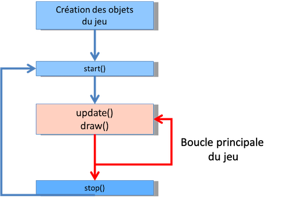
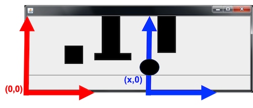
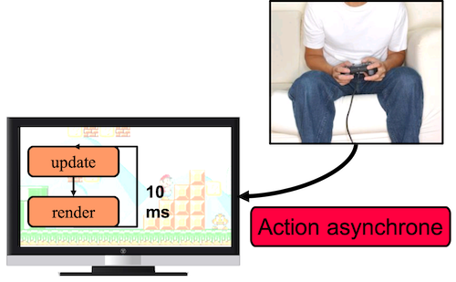
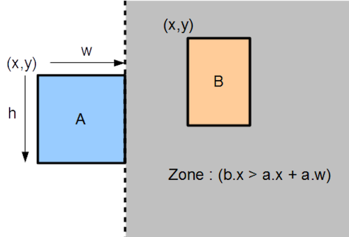
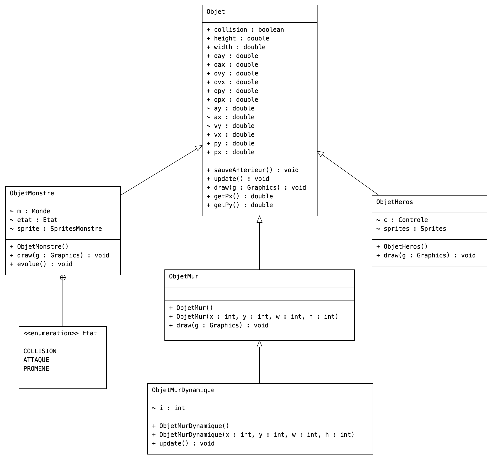

<!-- pandoc  -N  --variable mainfont="Palatino"  -V linkcolor:blue --include-in-header listings-setup.tex  --listings --variable sansfont="Helvetica" --variable monofont="Menlo" --variable fontsize=12pt --variable version=2.0  --pdf-engine=xelatex -o archiMoteurDeJeu.pdf archiMoteurDeJeu.md -->

La bibliothèque de moteur de jeu, adopte une architecture du type [Modèle-Vue-Contrôleur](https://fr.wikipedia.org/wiki/Modèle-vue-contrôleur). Elle est composée de ces trois entités sous forme de pacquage (`afficheur`, `physique`, `controle`) ansi que du package `main`.

# Sommaire : <!-- omit in toc -->
- [package `main`](#package-main)
- [Package `afficheur`](#package-afficheur)
- [Package `controle`](#package-controle)
- [Package `physique`](#package-physique)

# package `main`

Il contient deux classes :

- `JeuPhysique` qui contient les méthodes `update()` pour actualiser les événements et `render()` pour lancer l'affichage graphique.
- `BouclePrincipale` qui contient la boucle du jeu et contrôle la fréquence d'affichage.

# Package `afficheur`

Ce package correspond à la **vue**. Il correspond donc à tout ce qui est lié au dessin dans l'interface graphique via la classe `Graphics2D` de [Swing](https://en.wikipedia.org/wiki/Swing_(Java)).

Plus spécifiquement :

- La classe `Afficheur` permet de créer la fenêtre `JFrame`, contient le code pour faire du [double buffering](https://en.wikipedia.org/wiki/Multiple_buffering#Double_buffering_in_computer_graphics) et la méthode `render()` pour afficher tous les éléments du jeu.
- Les classes `DecorFixe`et `DecorVariable`permettent de gérer les décors (position, image, mouvement, affichage).
- Les classes `Sprite`, `Sprites`, `SpritesHeros` et `SpritesMonstre`permettent de gérer l'affichage des éléments qui se déplacent.
- La classe `Repere` gère le repère qui peut soit être lié au décors soit lié au hero.

# Package `controle`

Ce package correspond au **contrôle**. Il correspond à la gestion des événements. Les événements peuvent être liés à l'appui sur un bouton d'une interface graphique, au clavier, à la souris, à un joystick, etc. Ici, uniquement les éléments clavier sont pris en compte via l'implémentation de l'interface `KeyListener` du package [Swing](https://en.wikipedia.org/wiki/Swing_(Java)).

Il contient principalement deux classes :

- `Controle` : elle permet d'assigner l'intention de déplacement. C'est cette information qui sera donné au moteur physique.
- `ControleClavier` : c'est elle qui gère les événements clavier. Elle permet de donner une valeur à un des attributs de `Controle`.

# Package `physique`

Ce package correspond au **modèle**. Il correspond à la création des éléments du jeu ainsi qu'au moteur physique.

Les classes sont :

- `Collision` : c'est la classe qui gère les collisions. Il y a deux actions : savoir s'il y a eu une collision entre deux objets et gérer cette collision en changeant la position d'un des deux objets.

- `Monde` : elle correspond à l'ensemble des éléments du jeu. Il contient donc :
  - un hero ou des héros.
  - des monstres.
  - des murs.
  - un contrôleur.
Elle contient aussi les méthodes permettant de créer ces éléments.
- `MoteurPhysique` : l'élément principal de cette classe est la méthode `update()`. Elle permet à chaque pas de temps de faire évoluer les éléments du monde en fonction des événements clavier, des collisions, des comportements des monstres, de la gravité, etc.
- `Objet` : C'est la classe qui permet de gérer tous les objets physiques. Un objet physique est caractérisé par :
  - sa vitesse (`ovx`,`ovy`)
  - sa position (`opx`,`opy`)
  - son accélération (`oax`,`oay`)$
  - sa boite englobante pour gérer les collisions (`width`, `height`)
  - un index de l'élément parmi son type (Monstre , Mur, etc...) : `index`
  - un attribut `collision` pour savoir si un objet est en collision

Il existe plusieurs classes qui héritent de `Objet`:

- `ObjetHero` pour le personnage à déplacer par le contrôleur
- `ObjetMonstre` pour gérer des monstres dont le comportement est défini par une intelligence artificielle 
-  `ObjetMur` pour gérer des murs 
- `ObjetMurDynamique` pour gérer des murs ayant un mouvement cyclique

 

  
